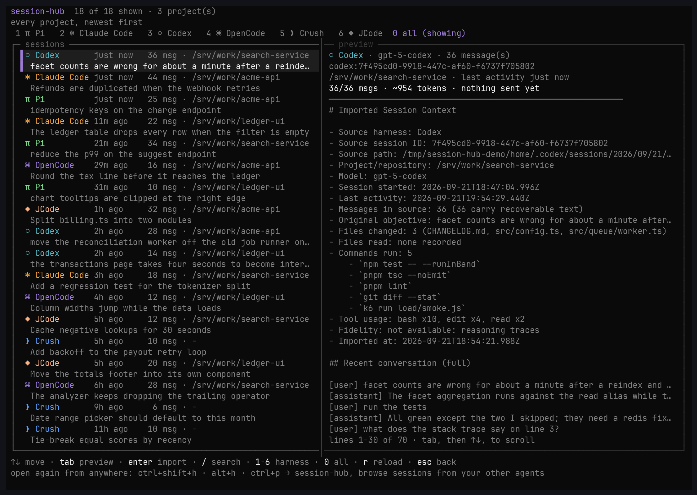
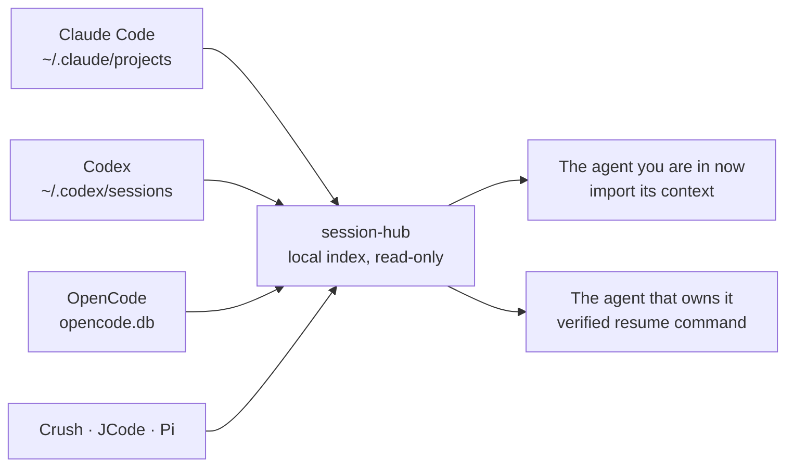

<div align="center">



<h1>session-hub</h1>

<p><strong>Every coding agent on your machine, in one session list.<br/>Continue in this one the work you left in that one.</strong></p>

<p>
<a href="package.json"></a>
<a href="LICENSE"></a>
<a href="#the-mcp-server"></a>
</p>

<p>
<strong><a href="#opencode">OpenCode</a></strong> ·
<strong><a href="#claude-code">Claude Code</a></strong> ·
<strong><a href="#codex">Codex</a></strong>
</p>

<sub>Reads sessions from Pi, Claude Code, Codex, OpenCode, Crush and JCode · local, read-only, no network</sub>

</div>

---

## The problem

You work across more than one coding agent. You start a refactor in OpenCode, then open
Claude Code for a second opinion, or you are deep in a Codex session and want to finish
it somewhere else.

Every agent keeps its own history, in its own format, in its own directory. Nothing
carries over. So you do the only thing left: re-explain. What the task was, which files
you touched, what the error said, which approach you already ruled out. The context
window resets and you spend the first ten minutes rebuilding what you already knew.

`session-hub` removes that step. It reads the session stores every agent already writes,
puts them in one list, and turns the one you pick into a context package the agent you
are in now can actually use. It ships as an MCP server with three read-only tools, plus a
plugin for each agent that puts them inside the chat you are already in.

## What it does

| | |
| --- | --- |
| **One list, every agent** | Pi, Claude Code, Codex, OpenCode, Crush and JCode sessions together, each row labelled with its agent, project, age and size. |
| **Continue here what you started there** | Pick a session and its conversation arrives in this one, tiered and budgeted, so your next message already has the context you would have re-explained. |
| **Or go back to where it lives** | `sessionhub native <uid>` prints the resume command the owning agent understands, with the evidence for it, or refuses when there is no verified command. |
| **Read without spending tokens** | The browser and `sessionhub show` read transcripts straight off disk. No model is involved. |
| **Nothing is imported unless you pick it** | No session arrives on its own, and no external session is ever rewritten into another agent's format. |
| **Local and read-only** | The only writable path is `~/.session-hub/`. Every agent's store is opened read-only, and there is no network access. |



## Requirements

| | |
| --- | --- |
| Runtime | Node 22.5 or newer |
| Dependencies | none. The index uses the built-in `node:sqlite` with FTS5 |
| Build step | none. The hub runs TypeScript directly |
| Platform | Linux, macOS, Windows |

## Install

```bash
git clone https://github.com/Gateton/session-hub
cd session-hub
./install.sh          # Linux, macOS
.\install.ps1         # Windows
```

Or call the installer directly:

```bash
node bin/sessionhub.mjs install
```

It finds the agents on your `PATH`, shows their versions, and **asks which ones you want
session-hub in**. Nothing is installed into an agent you did not pick. Then it:

1. stages the hub in `~/.session-hub/src`, so nothing depends on where the code came from
   and a moved checkout cannot break an installed plugin;
2. installs into your choices;
3. links `sessionhub` into `~/.local/bin` (and prints the `export PATH` line if that
   directory is not on your `PATH`);
4. wires Codex's delivery hooks and asks before touching its hook-trust setting.

For scripts, where there is nobody to ask:

```bash
node bin/sessionhub.mjs install --only codex --json
node bin/sessionhub.mjs install --all --dry-run
```

`--dry-run` prints every command it would run and changes nothing.

### Per agent, by hand

Substitute the directory you cloned into for `/path/to/session-hub`.

| Agent | What to run |
| --- | --- |
| Claude Code | `/plugin marketplace add /path/to/session-hub`, then `/plugin install session-hub@session-hub` |
| Claude Code, from a shell | `claude plugin marketplace add /path/to/session-hub`, then `claude plugin install session-hub@session-hub` |
| Codex | `codex plugin marketplace add /path/to/session-hub`, then `codex plugin add session-hub@session-hub` |
| OpenCode | `opencode plugin /path/to/session-hub/integrations/opencode -g` |

Every one of them is a command line entry point, so none of this needs a TUI.

## How it works in each agent

The hub underneath is the same everywhere: one binary reads every agent's session store
read-only, indexes it locally, and turns the session you choose into a context package.
What differs is how you reach for it, and how the conversation arrives.

### OpenCode

OpenCode is the only one of the three with an API for a real terminal UI, so this is
where the browser lives. That is the screenshot at the top of this page.

| | |
| --- | --- |
| What you install | one plugin in two halves: the tools and `/hub` in the conversation, plus the full-screen browser |
| How you open it | `ctrl+shift+h`, or `alt+h`, or `ctrl+p` then *session-hub: browse sessions from your other agents* |
| The tools | `sessionhub_find`, `sessionhub_search`, `sessionhub_load`, `sessionhub_reopen` |
| In the conversation | `/hub` lists this project, `/hub <words>` searches every transcript, `/hub load <uid>`, `/hub pending`, `/hub reopen <uid>`, `/hub clear` |
| How the conversation arrives | a pick is handed to `chat.message`, so it reaches the model with your next message, once |
| Manual step | none |

**The browser.** One list of every agent's sessions, a preview of the exact package that
would be imported at the budget that will be used, and the keys in the footer.

| Key | What it does |
| --- | --- |
| `↑` `↓`, `k` `j` | move the selection; the preview follows |
| `PageUp` `PageDown` | move five at a time |
| `Home` `End` | first or last session |
| `Tab` | switch between the list and the preview |
| `Enter` | import the selected session, after a confirmation showing the cost |
| `/` | filter the loaded list; `Enter` keeps the filter, `Esc` clears it |
| `1` to `6` | filter by agent (`1` Pi, `2` Claude Code, `3` Codex, `4` OpenCode, `5` Crush, `6` JCode) |
| `0` | clear the agent filter |
| `r` | re-read the hub index |
| `Esc` | leave the browser |

Each agent has its own marker and its own colour, `π` Pi, `✻` Claude Code, `⬡` Codex,
`⌘` OpenCode, `❯` Crush, `◆` JCode, so a row says which agent it belongs to before you
read the label. Two panes above 90 columns, one pane below it, so 80x24 is a supported
size rather than an accident.

```bash
export SESSION_HUB_ASCII=1        # plain letters, for terminals without symbol coverage
export SESSION_HUB_KEYBIND="ctrl+shift+s"   # the key that opens the browser
```

### Claude Code

| | |
| --- | --- |
| What you install | a plugin: one skill, two hooks, one MCP server named `hub` |
| How you ask | in plain language. *"continue what I left in Codex"*, *"the session where we fixed the parser"*. The skill teaches the model when to reach for the tools |
| The tools | `mcp__plugin_session-hub_hub__search`, `...__context`, `...__native` |
| How the conversation arrives | `context` brings it in during that turn, or you pick one with `sessionhub pick <uid>` and the `UserPromptSubmit` hook delivers it with your **next** message |
| Manual step | none |

The plugin carries the hub with it: on the first session start it vendors a copy of the
hub into itself, so `claude plugin install` works with no global setup and keeps working
even if the checkout it came from moves.

If the injected block is longer than Claude Code's 10,000 character limit for hook
context, it is cut in the middle, the cut says so, and the head and the closing line stay
intact. The rest is one `context` call away at the same uid.

### Codex

| | |
| --- | --- |
| What you install | a plugin: one skill, one MCP server, and two hooks |
| How you ask | the same plain language. The tools appear as `hub.search`, `hub.context`, `hub.native` |
| How the conversation arrives | the same two paths: `context` for this turn, or a pick delivered by the `UserPromptSubmit` hook |
| Manual step | **trust the hooks once**, in `/hooks`. The installer offers to set `bypass_hook_trust` instead, and explains what that means |

Codex refuses to run a hook it has not been told to trust, and trusting happens in its
`/hooks` dialog, which cannot be driven from a script. Two ways out:

1. Run `/hooks` once and trust the two session-hub entries. This is the default, and the
   installer leaves it to you.
2. Let the installer set `bypass_hook_trust = true` in `~/.codex/config.toml`. It asks
   first, because that line applies to **every** hook in that file, not only these.
   `--trust-hooks` and `--no-trust-hooks` answer it in advance, and
   `node integrations/codex/scripts/install-hooks.mjs --no-trust` removes it again.

Until the hooks are trusted, the tools and the skill still work: you can load a session
by asking for it. What you lose is a pick arriving on its own.

Codex runs shell commands under a sandbox, so the hub reads an index it is not allowed to
rewrite and says so. The MCP tools run outside that sandbox and are unaffected; to give
the shell fallback access to the hub home, start Codex with `codex --add-dir ~/.session-hub`.

## The MCP server

The same three read-only tools are available to any MCP client, with or without a plugin.

| Tool | What it does |
| --- | --- |
| `search` | Finds sessions across every agent, by words, project or agent. Returns uid, agent, project, time and title for each match. |
| `context` | Loads one session's conversation into this one, inside a character budget. |
| `native` | The verified command that reopens that session in the agent that owns it. |

All three declare themselves read-only, idempotent and closed-world. Register the server
yourself if you would rather not install a plugin:

```bash
claude mcp add session-hub -- node /path/to/session-hub/mcp/server.mjs
codex  mcp add session_hub -- node /path/to/session-hub/mcp/server.mjs
```

You get the tools in every session. You lose two things: the automatic delivery of a
session you picked, and the skill that tells the agent when to go looking.

## How much context arrives

Loading a whole conversation would be wasteful, and the cost would grow without bound as
sessions get longer. The package is therefore **tiered, with a hard budget** (40k
characters, about 10k tokens, by default):

| Tier | Contents | Cost |
| --- | --- | --- |
| 1. Header | objective, repo, model, files changed and read, commands run, tool usage | ~1k characters, always included |
| 2. Recent tail | the last turns **verbatim**, because that is what you continue from | up to 26k characters |
| 3. Earlier | one line per older message, so the shape of the conversation survives | remainder |
| 4. Omitted | a count, never silence | 0 |

Two decisions make that affordable: tool output is compressed to a short preview in every
tier (on real sessions it was 90% of the bytes and the least useful part for resuming
work), and when the budget runs out the **oldest** messages condense or drop, never the
tail. The cost is printed every time, and `--chars` sets the ceiling.

## Using it

Ask in plain language. The skill tells the agent when the hub is worth reaching for, and
the agent decides between loading the context now or arming a pick for your next message.
You can also be direct:

```text
/hub                                  # sessions of this project, every agent
/hub turnero urgencias                # search every transcript
/hub load codex:0191ab...             # import it, delivered with the next message
```

### Commands

```
sessionhub here [--dir D]              sessions of the project you are standing in, every agent
sessionhub list [--harness H]          newest first, across everything
sessionhub search "words"              find sessions
sessionhub search "words" --deep       read full transcripts when the index is not enough
sessionhub context <uid> [--chars N]   the tiered, budgeted package
sessionhub show <uid>                  the transcript, read-only, no model involved
sessionhub handoff <uid>               a deterministic handoff document
sessionhub native <uid>                the verified resume command, or a refusal
sessionhub pick <uid>                  choose a session to arrive with your next message
sessionhub pending [--take|--peek|--clear]   what is armed: print it, peek, or cancel
sessionhub doctor                      which agents were found, how many sessions each
sessionhub index [--force]             rebuild the local index
sessionhub install [--only|--all]      install into the agents you choose
sessionhub setup | vendor | version | mcp
```

Every command takes `--json`, prints only payload on stdout and diagnostics on stderr, so
`sessionhub context <uid>` can be piped straight into a prompt. A `uid` is
`<agent>:<nativeId>`, and a unique prefix is enough.

### Search

`sessionhub search` and the browser's transcript path use a local SQLite FTS5 index:

- bare terms use prefix matching, so `pliego` matches `pliego-prod`
- `"exact phrase"` matches a phrase
- `-term` excludes

The index stores each session's title, metadata and a bounded excerpt of the conversation
(20k characters, sampled from both the start and the end). `search --deep` goes further
and reads whole transcripts when the excerpt is not enough; it reports how many sessions
it read, so a partial answer never looks complete.

## Guarantees

### Nothing outside the hub home is written

The only writable path is `~/.session-hub/` (the index, the armed selection, the install
record). Every agent's store is opened read-only, including the SQLite databases. The
acceptance suite fingerprints every store before and after a full scan and fails if
anything changed.

### External sessions are never disguised as yours

A Claude, Codex, OpenCode, Crush or Pi conversation is **never** converted into another
agent's session format. There are exactly two paths:

- **Reopen it where it lives**: the hub prints the command the owning agent understands,
  states how it verified that command, and refuses when it has no verified command rather
  than handing you one that would fail.
- **Import its context here**: the conversation arrives in a new message labelled with the
  source agent, session id and path, generated locally and deterministically. No model, no
  network, nothing uploaded. Fields the source format cannot supply are written as
  `not available` rather than guessed.

## Supported agents

| Agent | Store | Format | Resume |
| --- | --- | --- | --- |
| Pi | `~/.pi/agent/sessions/--<cwd>--/*.jsonl` | JSONL tree v3 | `pi --session <path>` |
| Claude Code | `~/.claude/projects/<slug>/*.jsonl` | JSONL | `claude --resume <uuid>` |
| Codex | `~/.codex/sessions/YYYY/MM/DD/rollout-*.jsonl` | JSONL | `codex resume <id>` |
| OpenCode | `~/.local/share/opencode/opencode.db` | SQLite | `opencode --session <id>` |
| Crush | `~/.crush/crush.db` | SQLite | `crush --session <id>` |
| JCode | `~/.jcode/sessions/*.json` | JSON | `jcode --resume <id>` |

Each agent gets its own adapter. A missing, empty or unreadable store degrades to a
specific message ("no store at ...", "cannot read ...") instead of an empty list, and one
broken adapter never takes down the others.

## Privacy

- The index lives at `~/.session-hub/index.sqlite`. Delete it and the next scan rebuilds
  it.
- Credential stores are never opened. `auth.json`, `.credentials.json`, `.env`,
  `request_dump_*` and similar are refused by name before any open is attempted.
- Transcript text passes through a redactor (bearer tokens, `sk-` keys, JWTs, `api_key=`
  and `password=` patterns) before it is stored or written into a handoff.
- No network access, ever, for indexing or searching.

## Limitations

- **Claude Code and Codex formats are undocumented.** The parsers are defensive and
  degrade to filename-derived metadata rather than throwing, but a format change can cost
  fields until the adapter is updated.
- **Crush does not record a session working directory**, so those sessions show no project
  and cannot be filtered by one.
- **Claude sub-agent transcripts** are indexed but cannot be resumed by id; the hub
  refuses instead of offering a command that would fail.
- **Search covers a bounded excerpt**, not the whole history of a very long session.
  `--deep` is the way past that.
- **Installed plugins use the staged copy** at `~/.session-hub/src`, not your checkout.
  After changing the code, run the installer again to restage it.

## Documentation

| Where to go | What you will find |
| --- | --- |
| [`integrations/opencode/README.md`](integrations/opencode/README.md) | The browser, `/hub`, the four tools, keybinds, colours and the filter |
| [`integrations/claude/README.md`](integrations/claude/README.md) | The plugin, the two hooks, first-run vendoring and the vendored layout |
| [`integrations/codex/README.md`](integrations/codex/README.md) | The plugin, hook trust, the MCP wiring and Codex's sandbox |
| [`docs/demo.md`](docs/demo.md) | How the screenshot at the top of this page is produced |

## Development

```bash
node test/acceptance.mjs        # the full suite, against the real stores and a foreign home
node tools/make-demo-image.mjs  # regenerate the screenshot (drives OpenCode in a real PTY)
```

The suite runs against the stores on this machine and against a synthetic home this
project has never seen, and asserts among other things that no external store file is
modified, that every resume command is verified or refused, and that reading a home with
no agents says so instead of looking empty.

## License

MIT
